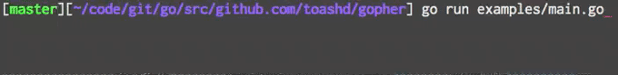

# Gopher
Gopher renders little `( ◔ ౪◔)´ to the command line.

Use gopher just for pure fun or more meaningful as a loading spinner.

[](https://travis-ci.org/toashd/gopher)

## Installation

Install gopher with a simple

```bash
$ go get github.com/toashd/gopher
```

## Usage
Import the gopher package

```go
import "github.com/toashd/gopher"
```

Create a new gopher

```go
g := gopher.New()                   // Create gopher with default values
g.Start()                           // Start the gopher

time.Sleep(4 * time.Second)         // Run for some time to simulate some serious work

g.SetActivity(gopher.Loving)        // Change the gophers activity
g.SetColor(gopher.Magenta)          // Change the gophers color
g.SetPrefix(gopher.Loving.String()) // Prepend text
g.SetSuffix("golang")               // Append text

time.Sleep(4 * time.Second)         // Run for some time to simulate some serious work

g.Stop()                            // Stop the gopher
```

To simply print a gopher use

```go
fmt.Println(g)
```

Gopher currently supports four different gopher activities: *Waiting, Wondering, Boring, and Loving*.

Want to see gophers in action, checkout the examples or build your own!



## Contribution

Please feel free to suggest any kind of improvements, refactorings or just more funny gopher activities.
Get in touch, file an issue, fork and submit a pull requests.

## Get in touch

Tobias Schmid, [@toashd](http://twitter.com/toashd)

## License

Gopher is available under the MIT license. See the LICENSE file for more info.
